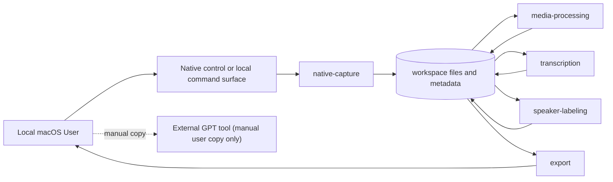
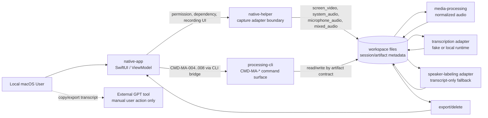

# 8. 实现指导

本文件定义技术栈、应用边界、模块职责、依赖策略和部署约束。仓库结构、命令、测试和 CI 的落地由 `docs/engineering/` 维护。

## 平台和运行环境

| 项 | 决策 |
|---|---|
| 目标平台 | macOS |
| MVP CPU 架构 | Apple Silicon (`arm64`) |
| MVP macOS 下限 | macOS 26.5.1，来源为 adoption 时本机 `sw_vers` 输出 |
| MVP 使用模式 | 个人本地使用 |
| 本地各自运行 | 多人使用时各自在自己的 Mac 上独立运行；不提供团队分发、共享空间、团队账号或集中支持 |

## 技术方向

| 领域 | MVP 方向 | 状态 |
|---|---|---|
| 录制 | 原生 macOS 录制优先；辅助 capture adapter 只能在技术 spike 证明 native 不可行后经 spec-change/ADR 纳入 | confirmed |
| 媒体处理 | 本地媒体处理工具，候选包括 FFmpeg 或兼容能力 | 已确认方向；具体依赖后续确定 |
| 转写 | Adapter-first 本地转写；首个真实 runtime 使用本地 `whisper.cpp` CLI + multilingual Whisper-compatible 模型 | confirmed |
| Speaker labeling | 本地 best-effort 匿名 speaker labeling；无可用引擎时降级 transcript-only | confirmed |
| 纪要生成 | 非 MVP 必需；用户可手动复制 transcript 到 GPT | confirmed |
| UI 交互面 | 设计化 Swift/SwiftUI native app shell + local helper / processing CLI；原始调试 UI 只作为中间形态 | confirmed |
| 数据存储 | 本地文件和元数据，不要求远程数据库 | confirmed |
| Cloud/API | MVP 应用不自动调用外部模型 API | confirmed for MVP boundary |

## 模块边界

Phase 2 允许用多个 worktree 并行推进，但调用方向必须保持单向和文件化边界：

并行模块边界如下：

| 模块 | 可并行实现内容 | 冻结接口 | 禁止跨越的边界 |
|---|---|---|---|
| `native-app` | 权限/依赖状态、录制控制、处理状态、回查/导出/删除 UI 和 view model 测试 | `06-api-contracts.md` 的 `CMD-MA-*` 响应；`04-user-journeys-and-ui.md` 和 `12-ui-ux-design.md` 的 UI state contract | 不直接解释 `processing-cli` 内部状态；不绕过 command contract 改写 artifact；不自动调用外部模型 |
| `native-helper` / capture adapter | macOS capture spike、fake capture adapter、停止录制后的 artifact 登记 | `07-data-and-events.md` 的 artifact contract；`CMD-MA-001`/`CMD-MA-002` 的成功/失败响应 | 不做转写、speaker labeling、导出或业务数据解释；不静默切换到未纳入事实源的辅助 capture |
| `processing-cli` command surface | 依赖检查、导入媒体、处理、转写、speaker fallback、导出和删除命令 | `06-api-contracts.md` 的命令输入/响应/error/exit code；`07-data-and-events.md` 的文件契约 | 不反向依赖 native UI；不把 stderr、临时日志或内部 Python 对象当产品契约 |
| `media-processing` | 音频源选择、标准化音频和媒体 fixture | `mixed_audio`、`system_audio`、`microphone_audio`、`normalized_audio` artifact 语义 | 不覆盖原始媒体；不新增未定义 artifact type；不自动下载或上传媒体 |
| `transcription-adapter` | fake adapter、local transcription adapter、runtime/model preflight 和 transcript artifact | `generate_transcript` 契约；`transcript.json` segment 排序和时间范围语义 | 不生成会议纪要；不调用外部 API；失败不覆盖已有有效 transcript |
| `speaker-labeling-adapter` | transcript-only fallback 和匿名 speaker label artifact | `generate_speaker_labels` 契约；匿名 label 与降级语义 | 不声称真实身份；不修改 transcript text；不把 diarization 质量当 MVP 强承诺 |
| `export/delete` | 本地导出、复制、删除摘要和路径边界测试 | `export_transcript`、`delete_session` 契约；workspace 内外路径保留语义 | 不自动上传；删除不得越过当前 workspace；不得删除 workspace 外导出文件 |

## 组件职责

| 组件 | 职责 | 不负责 |
|---|---|---|
| `native-app` | 设计化 Swift/SwiftUI app shell，提供预检、原生录制控制、权限提示、录制状态、停止保存反馈、处理状态、transcript 回查、复制/导出和删除确认 | 转写、speaker labeling、自动调用外部模型 |
| `native-helper` | 原生录制 helper 或本地服务边界，封装 capture adapter 和本地命令入口 | 业务数据解释、转写模型推理 |
| `processing-cli` | 依赖检查、音频格式处理、混音、校验、标准化处理输入、转写 adapter、speaker labeling adapter、导出 | 原生录制 UI、真实身份识别、自动上传 |
| `transcription-adapter` | 本地转写 adapter、时间戳 segments、transcript artifact | 真实身份识别、会议纪要生成 |
| `speaker-labeling-adapter` | best-effort 匿名 speaker labels；不可用时返回 transcript-only fallback | 真实姓名识别、强准确率承诺 |
| `export` | transcript 复制、Markdown/JSON/text 导出 | 自动上传到 GPT 或云服务 |
| `dependency-check` | 检查本地依赖、模型、权限和版本 | 自动安装所有依赖或自动改系统音频路由 |

## 依赖策略

| 依赖领域 | 策略 | 说明 |
|---|---|---|
| 原生 macOS 工具链 | 通过 bootstrap/check 脚本检查；人工安装 | 允许来源为 Apple 官方 Xcode/Command Line Tools |
| 媒体工具 | 通过 bootstrap/check 脚本检查；人工安装 | FFmpeg 或兼容能力是候选；脚本只检查，不自动下载 |
| 转写模型/runtime | Adapter-first，通过 bootstrap/check 脚本检查；人工安装 | VS-MA-06 首个真实 runtime 为本地 `whisper.cpp` CLI；模型必须由用户人工准备为 multilingual Whisper-compatible 本地文件 |
| Speaker labeling runtime | 通过 bootstrap/check 脚本检查；人工安装；允许缺失时降级 | WhisperX、pyannote.audio 或其他方案可作为后续 adapter 候选 |
| OBS/BlackHole | 不作为 MVP 主录制依赖 | 原生录制失败或用户改决策后可重新评估 |
| External GPT | 不作为应用依赖 | 仅允许用户手动复制或导出 transcript 后自行使用 |

## 原生录制方向

1. Phase 1 主路径是原生 macOS 录制，不以 OBS/BlackHole 作为主录制路径。
2. 原生录制实现必须输出 `07-data-and-events.md` 定义的文件和元数据契约。
3. 原生控制面采用设计化 Swift/SwiftUI app shell + local helper / processing CLI 的组合；实现早期可先落地最小/调试 UI，但 MVP UI 完成口径必须回到 `12-ui-ux-design.md` 的 designed shell 契约。
4. 具体 capture API、录制目标支持范围、视频编码、音频捕获方式和权限细节可以在组件骨架阶段以 adapter 方式细化，但不得改变 `07-data-and-events.md` 的 artifact contract。
5. 录制层必须是可替换 adapter，不得和转写、speaker labeling 或导出强耦合。
6. 如果系统音频或目标 capture 在 MVP 环境中被技术 spike 证明不可行或不稳定，只能先记录证据，并通过 `10-open-decisions.md`、ADR、主责分卷和验证矩阵更新后，才允许把 OBS/BlackHole/FFmpeg 等辅助路径纳入实现范围。

## 原生 capture spike 和可测试性

原生 capture 进入真实实现前，必须先建立可自动化的 adapter 测试边界：

1. `native-app` 必须先有 fake capture adapter 或等价测试替身，用于确定性覆盖权限缺失、开始、录制中、停止、保存失败和降级状态。
2. 技术 spike 必须记录 macOS 版本、CPU 架构、候选 capture API、录屏/麦克风权限状态、系统音频可用性、目标窗口或屏幕能力、生成 artifact 类型和失败模式。
3. spike 产物必须能回指 `PV-MA-002`、`PV-MA-003` 和 `PV-MA-009`；如果只有人工证据，验证矩阵只能保持 `manual-evidence` 或 `partial`，不能标 `covered`。
4. 真实 native capture adapter 必须暴露可测试的 adapter identity、capture capability summary、失败 code 和降级原因，便于 XCUITest、Swift Testing 或 local smoke 断言。
5. 录制失败时不得静默切换到 `import_media`、OBS、BlackHole、FFmpeg 辅助录制或其他 capture adapter；只能返回 `capture_failed`、`permission_denied` 或 `dependency_missing` 等已定义失败。
6. 辅助 capture adapter 进入产品路径前，必须先完成 spec-change、ADR、验证矩阵更新和对应负向测试，证明代码不会在未授权情况下自动切换。

## Phase 2 实现顺序

Phase 2 按本地组件纵切推进，不先创建 Web 前端、远程后端服务或数据库：

1. `processing-cli` 先实现 `check_dependencies`、稳定命令响应、错误码和契约测试。
2. 再实现 artifact contract、导入媒体、normalized audio、transcript adapter fake、speaker-label transcript-only fallback 和导出。
3. `native-app` 先负责最小 Swift/SwiftUI 控制面，并通过 Swift Testing 与 XCUITest 验证关键状态。
4. 在录制、处理、回查、导出和删除边界具备可测证据后，`native-app` 必须升级为设计化原生 app shell；该 shell 仍只通过既有 command/helper/adapter 契约触发行为，不绕过 processing-cli 或 artifact contract。
5. 每个真实产品行为进入实现时，必须同步更新对应 `PV-MA-*` 状态和证据。

## Bootstrap/Check 策略

Phase 1 采用 bootstrap/check 脚本，而不是一次性打包所有依赖。脚本只检查和提示，不自动下载模型、二进制或修改系统音频路由。

检查项至少包括：

1. 当前 macOS 版本和 CPU 架构。
2. 原生开发工具链是否可用。
3. 媒体处理工具是否可用。
4. 转写模型和 runtime 是否可用。
5. speaker labeling runtime 是否可用或明确不可用。
6. workspace 路径是否可写。
7. macOS 录屏、麦克风和文件访问权限状态是否可检测。
8. 依赖来源是否在允许来源清单内；版本/hash 锁定作为后续增强，不阻塞 MVP activation。
9. 本机硬件是否适合推荐的本地 transcription 模型等级；该检查只输出 CPU 架构、芯片名称和内存等级等非敏感摘要，不输出序列号、硬件 UUID 或 UDID。

## 本地转写 Runtime 策略

VS-MA-06 的目标是在不破坏 fake adapter 契约的前提下，接入或准备接入首个真实本地 transcription runtime。首个真实 runtime 固定为 `whisper_cpp`：

1. `runtime=whisper_cpp` 通过 `MEETING_ASSISTANT_TRANSCRIPTION_RUNTIME` 指向本地 `whisper.cpp` CLI 可执行文件，或可在 `PATH` 中解析的命令名。
2. `MEETING_ASSISTANT_TRANSCRIPTION_MODEL` 指向用户人工准备的本地 Whisper-compatible 模型文件。
3. 检查和运行不得自动下载模型、二进制、驱动或外部脚本，也不得调用外部 API。
4. 会议语音默认需要处理中英混合：中文为主，夹杂 `HTTP`、`LLM`、`clean architecture`、`EDA` 等英文技术词汇。真实 smoke 和 `PV-MA-007` covered 证据必须使用 multilingual 模型，不能使用 English-only `.en` 模型作为完整覆盖证据；优先使用 `large-v3` 或 `large-v3-turbo` 同级本地模型。
5. 小样例 smoke 必须固定在仓库测试或标准门禁可调用路径中，并包含中英混合技术词汇断言；没有真实 runtime 和该 smoke 证据时，`PV-MA-007` 保持 `partial`。
6. fake adapter 仍保留为确定性契约测试替身；真实 runtime adapter 必须输出与 fake adapter 一致的 `transcript.json` 契约：segments 按时间排序，`start_ms < end_ms`，失败不覆盖原始媒体或已有有效 transcript。
7. 在 replace policy 和 runtime metadata 尚未完整落地前，显式 runtime 请求不得复用不匹配或无法证明匹配的现有 transcript。
8. 部署 `whisper.cpp` 前必须用 `check_dependencies` 报告本机硬件 preflight：Apple Silicon `arm64` 且 16 GB 及以上 unified memory 可支持推荐的 `large-v3`、`large-v3-turbo` 同级 multilingual 模型进入真实 smoke；8 GB 到 16 GB 之间只能作为受限环境；低于 8 GB 或非 Apple Silicon 不适合作为该模型等级的产品验证环境。硬件 preflight 不能替代实际模型加载和 mixed-language smoke。

本机共享资产采用用户级目录，不放入项目仓库或单个项目的 `.tools` 目录：

1. runtime 版本目录：`~/.local/opt/whisper.cpp/<version>/bin/whisper-cli`。
2. runtime 当前入口：`~/.local/bin/whisper-cli`，指向当前选定版本的 symlink。
3. 模型根目录：`~/.local/share/ai-models/whisper.cpp/`，按模型族分目录，例如 `large-v3-turbo/`、`large-v3/`。
4. ASR smoke fixture：`~/.local/share/ai-fixtures/asr/zh-en-tech/mixed-zh-en-tech.wav`。
5. 该目录约定服务多个本地项目复用；应用和脚本只能检查、提示和使用用户显式配置的路径，不得自动下载、自动复制模型或静默改写 symlink。

## 配置和环境

1. 本地配置不得包含真实 secret。
2. 会议 workspace 默认使用 `~/Movies/MeetingAssistant/`。
3. 依赖路径、模型路径和 workspace 路径应可配置。
4. 产品化发布或商业化分发前必须重新审查签名、公证、自动更新、许可证和数据策略。

## Activation 骨架边界

project activation 时已经创建最小非业务组件骨架，用于注册 manifest、门禁和 E2E 计划：

1. `native-app` skeleton：最小 Swift/SwiftUI app 结构和空录制控制入口，不实现真实录制。
2. `processing-cli` skeleton：依赖检查、处理命令和 adapter 接口骨架，不实现真实转写或 speaker labeling。
3. full-stack/E2E 在本地应用语境下定义为“component skeleton + dependency-check + artifact contract smoke test”的受控组合；不要求远程服务或数据库。

后续在这些组件内实现真实产品行为时，必须先对齐对应 `AC-MA-*` 和 `PV-MA-*`，补充自动化测试，并把验证矩阵状态从 `planned` 推进到真实覆盖状态。

## 可观测性

1. 每个本地 command 生成 `request_id`。
2. 每个 session 生成稳定 `session_id`。
3. 日志记录权限检查、依赖检查、录制开始/结束、产物生成、转写和 speaker labeling 状态。
4. 日志不得记录完整 transcript、外部凭据或不必要的敏感会议内容。
