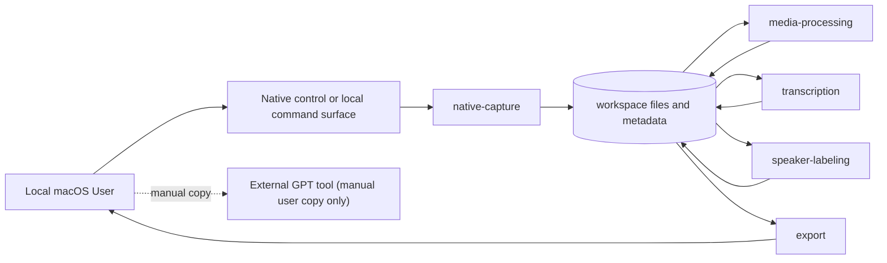

# 8. 实现指导

本文件定义技术栈、应用边界、模块职责、依赖策略和部署约束。仓库结构、命令、测试和 CI 的落地由 `docs/engineering/` 维护。

## 平台和运行环境

| 项 | 决策 |
|---|---|
| 目标平台 | macOS |
| MVP CPU 架构 | Apple Silicon (`arm64`) |
| MVP macOS 下限 | macOS 26.5.1，来源为 adoption 时本机 `sw_vers` 输出 |
| MVP 使用模式 | 个人本地使用 |
| 后续使用模式 | 少量团队内部使用，需另行确认权限、分发和数据治理 |

## 技术方向

| 领域 | MVP 方向 | 状态 |
|---|---|---|
| 录制 | 原生 macOS 录制优先 | confirmed |
| 媒体处理 | 本地媒体处理工具，候选包括 FFmpeg 或兼容能力 | 已确认方向；具体依赖后续确定 |
| 转写 | Adapter-first 本地转写；首个候选可复用现有本地 Whisper | confirmed |
| Speaker labeling | 本地 best-effort 匿名 speaker labeling；无可用引擎时降级 transcript-only | confirmed |
| 纪要生成 | 非 MVP 必需；用户可手动复制 transcript 到 GPT | confirmed |
| UI 交互面 | 最小 Swift/SwiftUI app + local helper / processing CLI | confirmed |
| 数据存储 | 本地文件和元数据，不要求远程数据库 | confirmed |
| Cloud/API | MVP 应用不自动调用外部模型 API | confirmed for MVP boundary |

## 模块边界

## 组件职责

| 组件 | 职责 | 不负责 |
|---|---|---|
| `native-app` | 最小 Swift/SwiftUI app，提供原生录制控制、权限提示、录制状态和停止保存反馈 | 转写、speaker labeling、自动调用外部模型 |
| `native-helper` | 原生录制 helper 或本地服务边界，封装 capture adapter 和本地命令入口 | 业务数据解释、转写模型推理 |
| `processing-cli` | 依赖检查、音频格式处理、混音、校验、标准化处理输入、转写 adapter、speaker labeling adapter、导出 | 原生录制 UI、真实身份识别、自动上传 |
| `transcription-adapter` | 本地转写 adapter、时间戳 segments、transcript artifact | 真实身份识别、会议纪要生成 |
| `speaker-labeling-adapter` | best-effort 匿名 speaker labels；不可用时返回 transcript-only fallback | 真实姓名识别、强准确率承诺 |
| `export` | transcript 复制、Markdown/JSON/text 导出 | 自动上传到 GPT 或云服务 |
| `dependency-check` | 检查本地依赖、模型、权限和版本 | 自动安装所有依赖或自动改系统音频路由 |

## 依赖策略

| 依赖领域 | 策略 | 说明 |
|---|---|---|
| 原生 macOS 工具链 | 通过 bootstrap/check 脚本检查；人工安装 | 允许来源为 Apple 官方 Xcode/Command Line Tools |
| 媒体工具 | 通过 bootstrap/check 脚本检查；人工安装 | FFmpeg 或兼容能力是候选；脚本只检查，不自动下载 |
| 转写模型/runtime | Adapter-first，通过 bootstrap/check 脚本检查；人工安装 | 首个候选可复用现有本地 Whisper；具体 adapter 在组件骨架后落地 |
| Speaker labeling runtime | 通过 bootstrap/check 脚本检查；人工安装；允许缺失时降级 | WhisperX、pyannote.audio 或其他方案可作为后续 adapter 候选 |
| OBS/BlackHole | 不作为 MVP 主录制依赖 | 原生录制失败或用户改决策后可重新评估 |
| External GPT | 不作为应用依赖 | 仅允许用户手动复制或导出 transcript 后自行使用 |

## 原生录制方向

1. Phase 1 主路径是原生 macOS 录制，不以 OBS/BlackHole 作为主录制路径。
2. 原生录制实现必须输出 `07-data-and-events.md` 定义的文件和元数据契约。
3. 原生控制面采用最小 Swift/SwiftUI app + local helper / processing CLI 的组合。
4. 具体 capture API、录制目标支持范围、视频编码、音频捕获方式和权限细节可以在组件骨架阶段以 adapter 方式细化，但不得改变 `07-data-and-events.md` 的 artifact contract。
5. 录制层必须是可替换 adapter，不得和转写、speaker labeling 或导出强耦合。

## Bootstrap/Check 策略

Phase 1 采用 bootstrap/check 脚本，而不是一次性打包所有依赖。脚本只检查和提示，不自动下载模型、二进制或修改系统音频路由。

检查项至少包括：

1. 当前 macOS 版本和 CPU 架构。
2. 原生开发工具链是否可用。
3. 媒体处理工具是否可用。
4. 转写模型和 runtime 是否可用。
5. speaker labeling runtime 是否可用或明确不可用。
6. workspace 路径是否可写。
7. macOS 录屏、麦克风和文件访问权限状态是否可检测。
8. 依赖来源是否在允许来源清单内；版本/hash 锁定作为后续增强，不阻塞 MVP activation。

## 配置和环境

1. 本地配置不得包含真实 secret。
2. 会议 workspace 默认使用 `~/Movies/MeetingAssistant/`。
3. 依赖路径、模型路径和 workspace 路径应可配置。
4. 生产或团队内部分发前必须重新审查签名、公证、自动更新、许可证和数据策略。

## Activation 骨架计划

activation 前允许创建最小非业务组件骨架，用于注册 manifest、门禁和 E2E 计划：

1. `native-app` skeleton：最小 Swift/SwiftUI app 结构和空录制控制入口，不实现真实录制。
2. `processing-cli` skeleton：依赖检查、处理命令和 adapter 接口骨架，不实现真实转写或 speaker labeling。
3. full-stack/E2E 在本地应用语境下定义为“component skeleton + dependency-check + artifact contract smoke test”的受控组合；不要求远程服务或数据库。

## 可观测性

1. 每个本地 command 生成 `request_id`。
2. 每个 session 生成稳定 `session_id`。
3. 日志记录权限检查、依赖检查、录制开始/结束、产物生成、转写和 speaker labeling 状态。
4. 日志不得记录完整 transcript、外部凭据或不必要的敏感会议内容。
